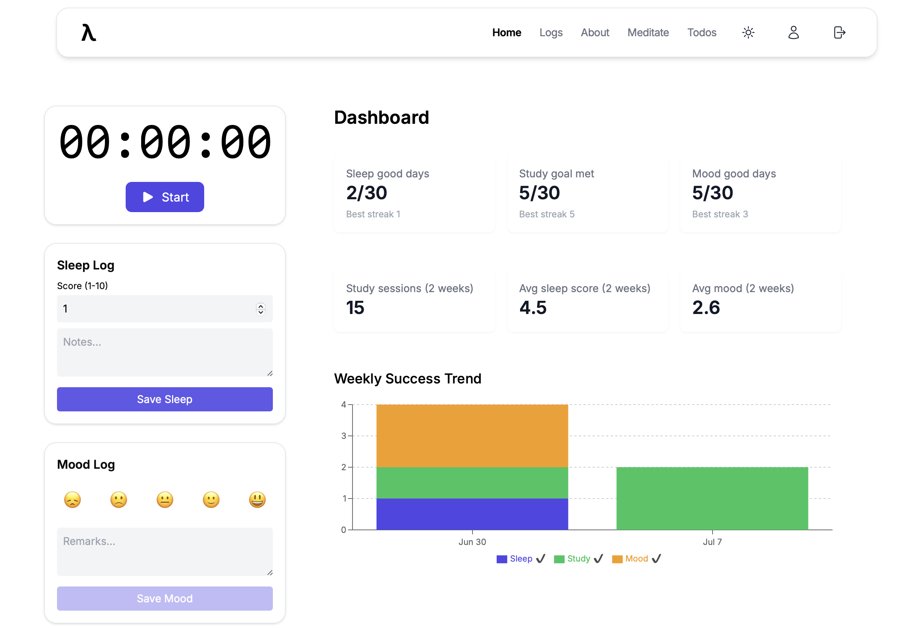
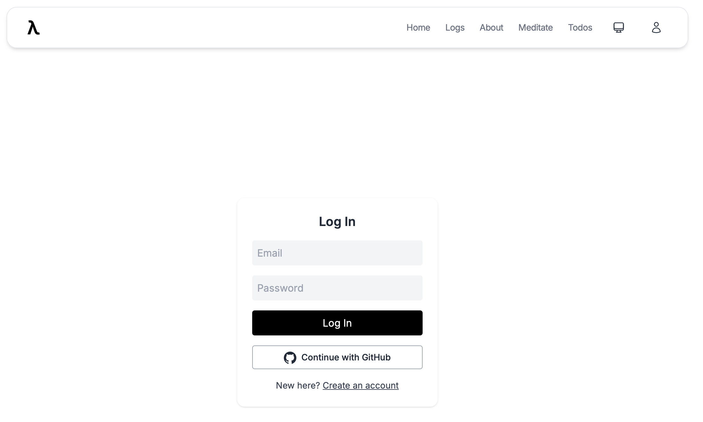
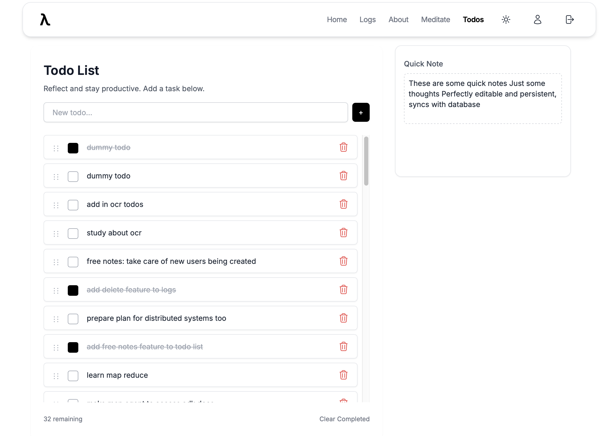
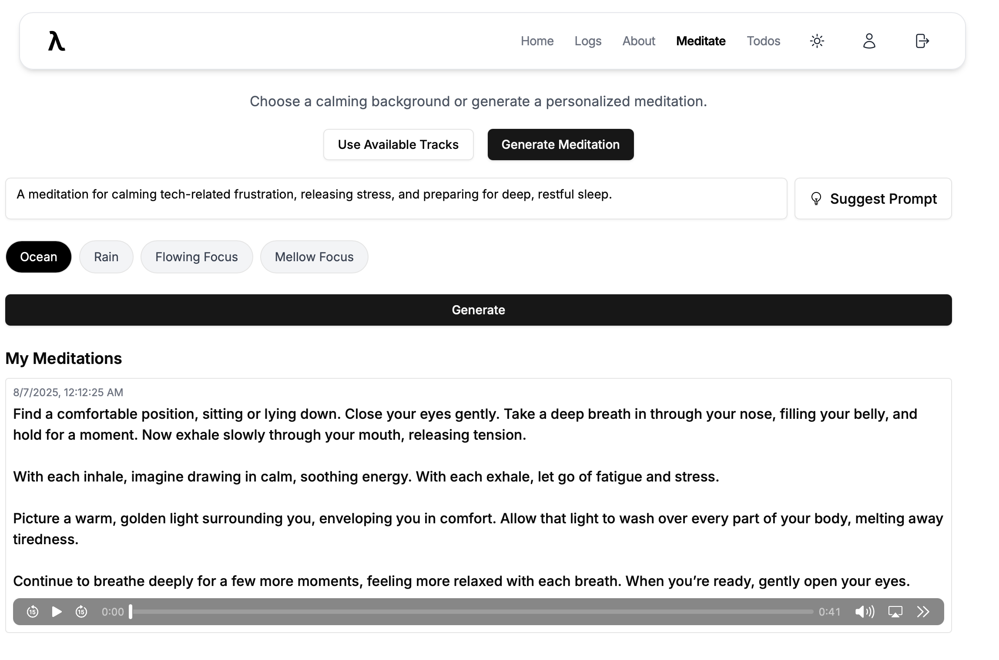
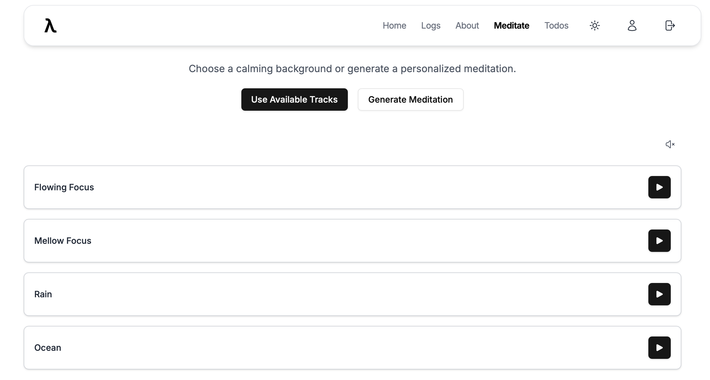
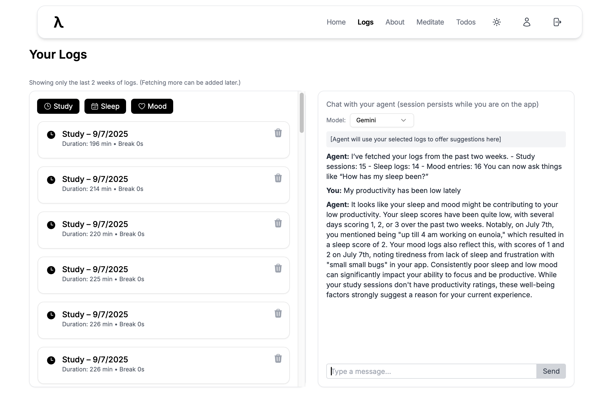
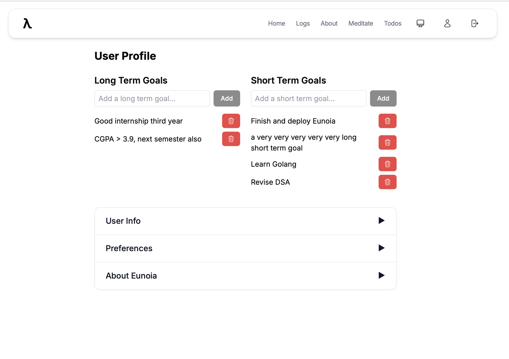
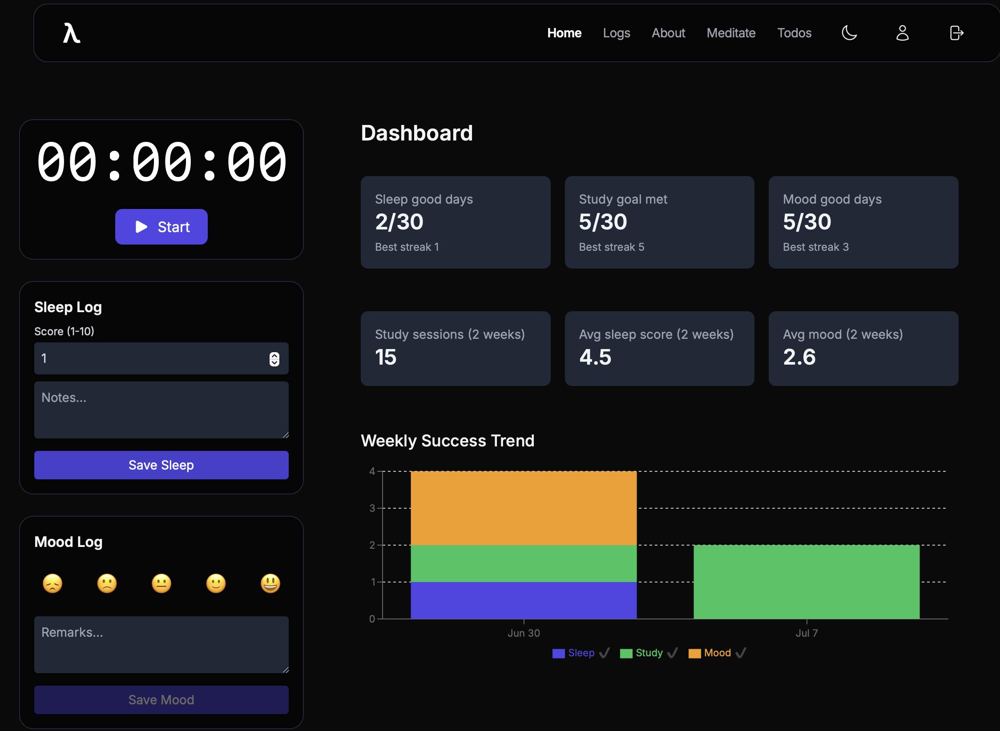

# Eunoia: Study & Wellness App

<!--
  Add screenshots of the app below! Recruiters love to see what the product looks like.
  For each main page, add a screenshot, and include one for dark mode as well.
  You can use Markdown image syntax: 
  Example: 
-->

## Screenshots

Below are screenshots of the main features and pages of Eunoia. Each image highlights a unique aspect of the app's user experience and functionality.

---

### Login Page


_Simple, login with Supabase authentication. Similar signup_

### Home Page


_The Home page brings together your study timer, sleep log, and mood log in a clean, two-column layout._

### Todo List


_The UI is responsive and supports editing, marking done/undone, deleting, and reordering todos. Syncs with database. So does the quick note. AI Integration is being developed_

### Meditate (AI-Generated)


_Experience personalized, AI-generated meditations. Notice how the prompt entered matches your recent mood log, ensuring each meditation is tailored to your current emotional state._

### Meditate (Preset Audio)


_Choose from a selection of calming preset audio backgrounds to enhance your meditation experience._

### Logs Page


_View a unified log of your study, sleep, and mood activities. Each entry is clearly labeled with icons and can be deleted instantly. Chatbot is log aware_

### User Profile


_Add or delete long term and short term goals. Would later be used as context for todo agent. Accordion too._

### Dark Mode


_Dark mode and system mode are integrated for all pages._

---

## Usage & Setup

### Prerequisites

- Python 3.9+
- Supabase CLI (for local dev and migrations)
- (Optional) Deno (for Supabase Edge Functions)
- (Optional) Node.js (only required for frontend build tooling, not for backend or runtime)

### 1. Environment Variables

You must configure environment variables for both the frontend and backend. See the new `env.example` files in each directory for required variables and copy them to `.env` (backend) and `.env` (frontend) as needed.

### 2. Supabase Setup

- Clone this repo and run `supabase start` in the `supabase/` directory to start the local Supabase stack.
- Run `supabase db reset` to apply all migrations and seed the database.
- Set your Supabase project URL and anon key in both frontend and backend env files.

### 3. Backend (FastAPI)

- Install dependencies: `pip install -r requirements.txt`
- Start the server: `uvicorn app.main:app --reload`
- The backend will connect to Supabase for chat sessions, meditation audio, and logs.

### 4. Frontend (React)

- The frontend is built with React (Vite, TypeScript, TanStack Query, TailwindCSS).
- Install dependencies: `npm install` (or `pnpm install`) in the `frontend/` directory. (Requires Node.js for build tooling only.)
- Start the dev server: `npm run dev`
- The frontend uses Supabase Auth for login, and all data is synced with Supabase tables.

### 5. Features & Current State

- **Chat sessions** are now stored in Supabase (see `chat_sessions` table and related migrations).
- **Todos** are fully CRUD and reorderable, but AI agent integration is not yet complete.
- **Meditation**: AI-generated meditations are stored in Supabase Storage and referenced in the DB.
- **Logs**: Study, sleep, and mood logs are unified and stored in Supabase.
- **Goals**: Long-term and short-term goals are managed in the profile and stored in Supabase.
- **AI Integration**: Only meditation and chat use AI for now. Todo agent and Vertex AI integration are planned for the future.

### 6. Database Schema Screenshot

To add a screenshot of your current database schema (all tables):

1. Open the [Supabase Studio](https://app.supabase.com/) for your project.
2. Go to the "Table Editor" or "Database" section.
3. Take a screenshot showing all tables and relationships.
4. Save it as `screenshots/schema.png` and add it to the `Screenshots` section above:
   ```md
   
   _All tables and relationships as generated by Supabase migrations._
   ```

---

## Environment Variables

See `backend/env.example` and `frontend/env.example` for all required variables. Copy and fill these as `.env` files in each directory.

---

## Backend

- **Framework:** FastAPI (Python)
- **Location:** `backend/`

### Key Folders and Files

- `app/` - Main FastAPI application code
  - `api/` - API endpoints for chat, meditation, and dependencies
  - `core/` - Configuration and logging utilities
  - `models/` - Pydantic and DB models (e.g., chat session)
  - `services/` - Business logic
    - `agents/` - Agent logic for OpenAI/Gemini (modular, ready for LLM integration)
    - `meditation.py` - Handles meditation prompt, transcript, TTS, and Supabase upload
    - `supabase_client.py` - Reusable Supabase client
    - `session_store.py` - In-memory session management
    - `supabase_logs.py` - Log fetching from Supabase
- `static/audios/` - Preset background audio files for meditation
- `generated_audios/` - Locally generated meditation audio (for development/testing, this was when audios were being served using fastapi instead of using supabase storage)
- `requirements.txt` - Python dependencies

### Data Storage

- **Logs and chat sessions:** Currently stored in memory or local files for development. Meditation audio and metadata are stored in Supabase Storage and DB.
- **No todo AI agent yet.**

## Frontend

- **Framework:** React (TypeScript, Vite, TanStack Query, TailwindCSS)
- **Location:** `frontend/`

### Key Folders and Files

- `src/components/` - Modular UI components
  - `TodoList/` - Todo list, drag-and-drop, and quick note components
  - `UserProfile/` - Goals management UI
  - `Meditate/` - Meditation generation and playback
  - `ui/` - Reusable UI primitives (button, card, accordion, etc.)
  - `Layout/` - Layout containers
- `src/pages/` - Top-level pages (Dashboard, TodoList, MeditateWithAI, UserProfile, etc.)
- `src/hooks/` - Custom hooks for todos, goals, logs, chat, etc.
- `src/types/` - Shared TypeScript types (todo, meditate, user, study)
- `src/lib/` - Utility and API client code (Supabase, session, study/sleep/mood logic)
- `src/assets/` - Audio and image assets
- `public/` - Static files and images
- `global.css` - Tailwind and global styles

### State and Data

- Uses TanStack Query for all data fetching, caching, and optimistic updates
- Session and log state is cached in sessionStorage for fast navigation
- All authentication and user management via Supabase Auth

## Supabase

- **Location:** `supabase/`
- **Purpose:** Database, authentication, storage, and migrations

### Key Folders and Files

- `migrations/` - SQL migrations for all tables (todos, meditations, goals, logs, etc.)
- `config.toml` - Supabase project configuration
- `.temp/` - Supabase CLI temp files

### Notable Tables

- `todos` - User todos with priority ordering
- `meditations` - Meditation transcripts and audio URLs
- `long_term_goals`, `short_term_goals` - User goals
- `free_notes` - Quick notes
- `study_sessions`, `sleep_logs`, `mood_logs` - User logs

## Notable Problems and Solutions

### Todo Priority and Drag-and-Drop

- **Problem:** Maintaining unique, gapless priorities for todos with drag-and-drop and insertions led to duplicate key errors and race conditions.
- **Solution:**
  - Used a two-phase SQL function to shift all priorities by +1000, then renumber starting at 2, leaving slot 1 free for new inserts.
  - All reordering and inserts happen inside a single SQL transaction to avoid unique constraint violations.
  - Optimistic UI updates and pointer event guards prevent drag-and-drop from interfering with checkbox and delete actions.

### React Hook Order Violation

- **Problem:** Conditional hook calls in the logs page caused React errors.
- **Solution:** All hooks are now called unconditionally at the top of each component. Data fetching is handled by TanStack Query with proper `enabled` flags.

### Session and Log Caching

- **Problem:** Session and log state was cached in sessionStorage for fast navigation, but this led to stale data if new logs were added.
- **Solution:** Switched to TanStack Query for all log fetching and caching, with invalidation on mutation.

### General

- All authentication is handled by Supabase JWTs.
- Meditation audio is stored in Supabase Storage, not on the server.
- The backend is ready for LLM agent integration but currently uses in-memory or local storage for logs and chat sessions.

## Folder Overview

### backend/

- FastAPI app, business logic, static and generated audio, requirements

### frontend/

- React app, modular components, hooks, types, assets, pages, global styles

### supabase/

- Database migrations, config, and project files

---

For more technical details, see the code and migration files in each folder.
